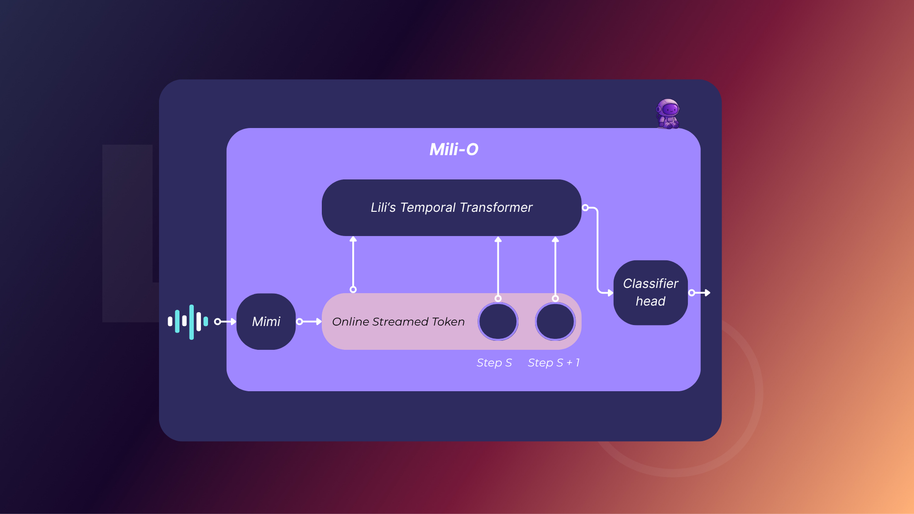

# Mili-O : Une architecture transformer temps réel pour la détection de prise de parole multi-locuteur

## Abstract

We introduce **Mili-O**, a real-time modular transformer architecture designed to continuously predict speaking intentions in dyadic and multi-speaker conversations using only raw audio input.

Mili-O learns to anticipate speaker intent and conversational shifts using a binary classification head built upon a temporal transformer architecture.

We first train a language-only model (LILI) to predict turn transitions, then align its latent space with audio token sequences produced by a neural codec, Mimi. 

Our experiments demonstrate that Mili-O achieves strong performance on both dyadic and multi-speaker corpora, with latency compatible with live deployment. This work bridges neural audio embeddings and conversational intelligence in real-time scenarios.

The next of this system would be to enable multinomial classification to enable a more complexe system.

## 1. Introduction

Natural turn-taking in human conversations relies on subtle signals: pauses, prosody, timing, semantic context, and speaker dynamics. Modeling this behavior in real-time is a critical challenge for intelligent vocal assistants. Instead of relying on explicit lexical content, Mili-O learns from raw audio signals to predict when it is appropriate to speak or remain silent in realistic multi-speaker scenarios. This direction follows recent trends in audio-based modeling for conversation understanding [1, 2].

In current dyadic dialogue systems, turn-taking is largely driven by silent pauses of sufficient duration, a strategy embedded in large models such as Gemini or ChatGPT. However, these systems remain reactive and fail to capture the nuances of overlapping or rapid interactions. The first shift from this paradigm is observed in Moshi, which demonstrates early signs of interruption prediction.

Other research efforts, like TurnGPT, rely exclusively on annotated text data and thus require an ASR → diarization → turn prediction pipeline, which is both resource-intensive and unsuitable for real-time or noisy environments. Moreover, no solution to date offers real-time turn-taking in multi-speaker environments without heavy reliance on transcriptions or dialogue structures.

Unlike traditional dialogue systems that require full transcription and semantic analysis, Mili-O operates on discrete audio tokens generated by a neural codec, allowing for low-latency inference and edge deployment. Through a two-phase training strategy—first on text, then on aligned audio—the model internalizes conversational dynamics without depending on specific lexical cues.

Our contribution introduces an architecture that leverages audio-only input for turn-taking, addressing challenges such as multiple speakers, overlapping speech, and real-time constraints. Mili-O represents a step toward naturalistic and non-intrusive conversational agents, designed to participate fluently in human interactions.

## 2. Related Work

Turn-taking prediction has traditionally relied on rule-based systems or supervised classifiers using handcrafted features [3, 4].

Recent work in neural approaches has explored RNN-based models on prosodic features [5], as well as transformer models using transcribed text [6].

Voice activity detection (VAD) and diarization also play important roles in related tasks [7], but differ in goal: VAD detects speech presence, while Mili-O focuses on predicting the intention to speak.

Mimi draws on research into neural audio codecs [8], offering streaming capabilities suitable for real-time deployment. For cross-modal alignment, approaches from speech-text dual encoders [9] and multimodal contrastive learning [10] informed our alignment procedure.

To our knowledge, Mili-O is the first system to combine semantic turn-taking learned from text with audio-only inference via token alignment, enabling context-sensitive decisions from raw sound.

## 3. Model

Mili-O consists of three components:

**Mimi**: a streaming neural audio codec that encodes 24 kHz audio into a sequence of discrete tokens at 12.5 Hz. These tokens retain acoustic and prosodic clues necessary for turn-taking decisions. Mimi uses vector quantization over learned codebooks and is trained independently before integration.

**Lili** : a lightweight text-only autoregressive language model based on the Transformer architecture (Vaswani et al., 2017). The following modifications have been applied to the standard transformer:

- We use **SentencePiece** (microsoft) tokenizer.
- We use **RMS normalization** (Zhang and Sennrich, 2019) at the input of the attention blocks, the feed-forward blocks, and the output linear layer.
- We adopt **rotary positional embeddings (RoPE)** (Su et al., 2024), which improve extrapolation to longer contexts and perform well with causal masking.
- We use **FlashAttention** (Dao et al., 2022) to allow for efficient attention computation during training and inference.
- We use **Grouped Query Attention** (GQA) to allow more faster inference and more efficent memory usage.
- The feed-forward network employs **Swiss** **Gated Linear Units (GLU)** (Shazeer, 2020).

**Classification Head** : A binary classifier head is attached to the last token of each window. The output is a sigmoid value interpreted as the probability of speaking. This structure supports both token-wise supervision and window-based decision strategies.

### 3.1 Architecture :

## 4. Data and Training

### 4.1 Phase 1: Lili Training on textual data

### 4.2 Phase 2: Audio Token Alignment

## 5. Results

At this stage, we focus on architectural and training pipeline validation. No quantitative results are presented yet. Preliminary qualitative inspection shows the model exhibits context-sensitive behavior after audio-only adaptation.

We plan to evaluate on:

- Prediction F1 score for turn-taking
- Real-time latency and memory footprint
- Robustness to overlapping speakers

## 6. Conclusion

**References**

[1] Skantze, G. (2021). Turn-taking in conversational systems and human-computer interaction: A review.

[2] Roddy, A. et al. (2022). SpeechTurn: Predicting speaker turns using self-supervised learning.

[3] Sacks, H., Schegloff, E.A., & Jefferson, G. (1974). A simplest systematics for the organization of turn-taking in conversation.

[4] Gravano, A., & Hirschberg, J. (2011). Turn-taking cues in task-oriented dialogue.

[5] Raux, A., & Eskenazi, M. (2009). A finite-state turn-taking model for spoken dialog systems.

[6] Adiwardana, D. et al. (2020). Towards a human-like open-domain chatbot.

[7] Zhang, A., & Wang, Q. (2023). Streaming speaker diarization with neural clustering.

[8] Zeghidour, N. et al. (2021). SoundStream: An end-to-end neural audio codec.

[9] Baevski, A. et al. (2020). wav2vec 2.0: A framework for self-supervised learning of speech representations.

[10] Radford, A. et al. (2021). Learning transferable visual models from natural language supervision (CLIP).